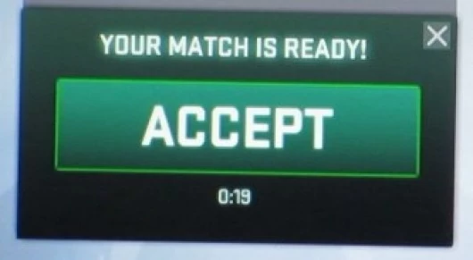

## The first version of my csgo server just started.

## It has bhop / surf config with timer

The server ip address is <a href="steam://connect/denyhax.com" target="_blank">denyhax.com</a>


Stats about the server available <a href="https://www.gametracker.com/server_info/denyhax.com:27015/" target="_blank">here</a>

Current maplist :
 - ```bhop_eazy_csgo```
 - ```bhop_monster_jam_b1```
 - ```bhop_forest```
 - ```bhop_adventure_csgo```
 - ```bhop_aztec_csgo```
 - ```bhop_badges```
 - ```surf_kitsune2_go```
 - ```surf_colours```
 - ```surf_kinshi```
 - ```surf_minecraft_2016_final```
 - ```surf_fruits_fix```
 - ```surf_highlands```
 - ```surf_utopia_v3```
 - ```surf_sup_```
 - ```surf_forbidden_ways_ksf```

I'm planning to extend the list with more oldschool maps.

Come and beat the records :)

<a href="steam://connect/denyhax.com" target="_blank"></a>
